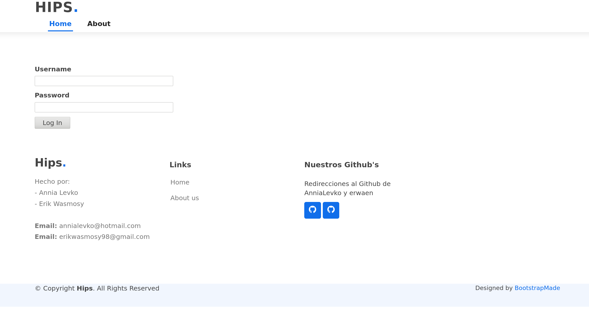
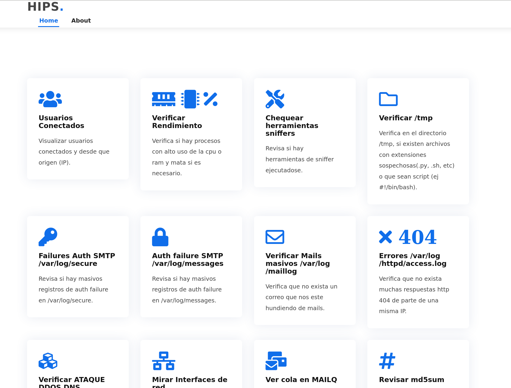

<!-- PROJECT LOGO -->
<br />
<p align="center">
  <a href="">
    
  </a>

  <h3 align="center">Sistema de prevencion y deteccion de intrusos</h3>

  
</p>


<!-- TABLE OF CONTENTS -->
<details open="open">
  <summary>Tabla de contenido</summary>
  <ol>
    <li>
      <a href="#acerca-del-proyecto">Acerca del proyecto</a>
      <ul>
        <li><a href="#construido-con">Construido con</a></li>
      </ul>
    </li>
    <li>
      <a href="#comenzando">Comenzando</a>
      <ul>
        <li><a href="#pre-requisitos">Pre requisitos</a></li>
        <li><a href="#instalacion">Instalacion</a></li>
      </ul>
    </li>
    <li><a href="#uso">Uso</a></li>
    <li><a href="#contacto">Contacto</a></li>
  </ol>
</details>


<!-- ABOUT THE PROJECT -->
# Acerca del proyecto

Este sistema fue creado para la asignatura "Sistema Operativos 2", con el fin de adquirir conocimientos sobre la importancia de tener un servidor seguro para evitar perder informacion importante.

En nuestro sistema de deteccion y prevencion de intrusos cubrimos ciertas partes de un sistema que podrian ser vulneradas por una persona. Citando algunas funciones que tiene nuestro sistema:

* Verificar las modificaciones realizadas en el archivo /etc/passwd y /etc/shadow.
* Verificar los usuarios conectados y su ip.
* Chequear sniffers.
* Examinar algunos archivos log.
* Verificar el tamanho de la cola mails del equipo.
* Verificar el consumo de recursos por parte de los procesos.
* Verificar directorio /tmp de archivos sospechos como scripts.
* Controlar ataques DDOS.
* Examinar archivos que estan ejecutandose como cron.
* Verificar intentos de accesos no validos.

### Construido con

* [Python3](https://www.python.org/downloads/)
* [Flask](https://flask.palletsprojects.com/en/2.0.x/)
* [Bootstrap](https://getbootstrap.com/)


<!-- GETTING STARTED -->
# Comenzando

Para ejecutar el sistema debemos seguir una serie de pasos, para que el sistema funcione correctamente.

# Pre requisitos
  * Estar logeado como usuario root o usuario con privilegios sudo 
  * Correr en un sistema de Centos 8
  * Utilizar Python3 (no otras versiones)

  Para la instalacion del sistema necesitamos instalar varias herramientas
  ## python3
  ```sh
  sudo yum install python3
  ```

  Si python3 no les trae incluido pip3
  ## pip3
  ```sh
  sudo yum install python3-pip
  ```
  
  ## PostgreSQL
  Para la base de datos de nuestro sistema, necesitamos instalar y configurar postgresql
  ```sh
  sudo yum install postgresql
  ```
  ```sh
  sudo yum install postgresql-server
  ```

  Creamos un nuevo cluster de la base de datos PostgreSQL
  ```sh
  sudo postgresql-setup --initdb
  ```

  Inciamos el servicio de postgres y habilitamos:
  ```sh
  sudo systemctl start postgresql
  ```
  ```sh
  sudo systemctl enable postgresql
  ```

  ## Crontab
  Instalamos cron
  ```sh
  sudo yum install cronie
  ```

# Instalacion
  Necesitamos instalar algunos modulos y hacer algunas configuraciones en nuestro sistema.

  ## Instalar Modulos de python3:
  * flask
    ```sh
    pip3 install --user flask
    ```
  * dotenv
    ```sh
    pip3 install --user python-dotenv
    ```
  * flask-bootstrap
    ```sh
    pip3 install --user flask_bootstrap
    ```
  * flask-wtf
    ```sh
    pip3 install --user flask_wtf
    ```
  * flask_sqlalchemy
    ```sh
    pip3 install --user flask_sqlalchemy
    ```
  * flask-login
    ```sh
    pip3 install --user flask_login
    ```
  * psycopg2
    ```sh
    pip3 install --user psycopg2
    ```

  ## Base de datos PostgreSQL
  *
    Cambiamos a la cuenta de postgres, para hacer algunas configuraciones
    ```sh
    sudo -i -u postgres
    ```

    <!-- Accedemos a Postgres
    ```sh
    psql
    ``` -->
  *
    Creamos un nuevo rol para root
    ```sh
    create user root with password '<BD_ROOT_PASSWORD>';
    ```
  *  
    Le asignamos los permisos necesario a root
    ```sh
    GRANT ALL PRIVILEGES ON ALL TABLES IN SCHEMA public TO root;
    ```

    <!-- Salimos de la cuenta de postgres
    ```sh
    exit
    ``` -->
  *
    Creamos una nueva base de datos llamada hips2021 
    ```sh
    createdb hips2021
    ```
  *
    Cambiamos el duenho de hips2021 a root
    ```sh
    alter database hips2021 owner to root
    ```

  ## Configuracion iptables
  *
    Paramos el servicio de firewalld service
    ```sh
    sudo systemctl stop firewalld
    ```
  *
    Deshabilitamos el servicio de firewalld
    ```sh
    sudo systemctl disable firewalld
    ```
  *
    'Maskeamos' el servicio de firewalld para que otro programa no lo invoque
    ```sh
    sudo systemctl mask --now firewalld
    ```
  *
    Instalamos iptables
    ```sh
    sudo yum install iptables-services -y
    ```
  *
    Comenzamos el servicio iptables
    ```sh
    sudo systemctl start iptables 
    ```
    ```sh
    sudo systemctl start ip6tables
    ```
  *
    Habilitamos el servicio para empezar
    ```sh
    sudo systemctl enable iptables
    ```
    ```sh
    sudo systemctl enable ip6tables
    ```
  *
    Chequeamos el estado del servicio iptables
    ```sh
    sudo systemctl status iptables 
    ```  
    ```sh
    sudo systemctl status ip6tables
    ```  
## Variable de entorno
*
  Necesitamos crear un archivo .env en el directorio de nuestro proyecto hips, para esconder nuestras contrasenhas de la base de datos, nuestro email de hips, el email del administrador, etc

  ```sh
  [root@localhost hips] vi .env
  ```
  Y Adjuntamos estos Valores
  ```sh
  BD_PASSWORD=<La_contrasenha_de_root>
  BD_USER=root
  SECRET_KEY=<Cualquier_palabra_podes_escribir_aca_es_solo_para_alg_de_flask>
  MY_HIPS_EMAIL=<gmail_del_hips>
  MY_HIPS_EMAIL_PASSWORD=<contrasenha_del_gmail_del_hips>
  MAIL_HIPS_ADMIN=<email_del_administrador_de_hips>
  ```
  guardamos el archivo.
  
  Cambiamos los permisos del archivo, para que solo root pueda usar
  ```sh
  [root@localhost hips] chmod 700 .env
  ```

## Generar contrasenha hash para el administrador del hips
*
  Ejecutamos una vez el servidor de hips (solo para que se cree automaticamente las tablas en la base de datos hips)
  ```sh
  [root@localhost hips] python3 server.py
  ```
  y apagamos el server
  ```sh
  control + c
  ```

  Corremos con python3 el archivo borrar.py que se encuentra en el directorio del proyecto para generar una contrasenha encriptada para un usuario del hips
  ```sh
  [root@localhost hips] python3 borrar.py
  ```
  Ingresas la contrasenha del administrador que va a usar el hips, dale a enter y copiamos la contrasenha encriptada  que imprime en consola

  Pasamos a cargar el administrador de hips en la base de datos:
  * Entramos de nuevo al usuario de postgres y abrimos postgres
    ```sh
    psql
    ```
  * Seleccionamos la base de datos hips2021
    ```sh
    postgres=$ \c hips2021
    ```
  * Insertamos el usuario/administrador en la tabla de users el administrador que va a ingresar al sistema hips2021
    ```sh
    hips2021=$ INSERT INTO users (username, password) values ('<username_admin>', '<contrasenha_encriptada_que_copiamos>');
    ```  


## Crear Carpetas necesarias
*
  En el directorio del projecto hips, necesitamos crear varias carpetas que se usan para almacenar resultados, estos resultados se leen y se borran una vez mostrado en la pagina web.
  ```sh
    [root@localhost hips] mkdir ./resultados
  ```
  ```sh
    [root@localhost hips] mkdir ./resultados/base_de_datos
  ```
  ```sh
    [root@localhost hips] mkdir ./resultados/cola_correo
  ```
  ```sh
    [root@localhost hips] mkdir ./resultados/sniffers
  ```
  ```sh
    [root@localhost hips] mkdir ./resultados/usuarios
  ```
  ```sh
    [root@localhost hips] mkdir ./resultados/verificar_logs
  ```
  ```sh
    [root@localhost hips] mkdir ./resultados/verificar_procesos
  ```
  ```sh
    [root@localhost hips] mkdir ./resultados/verificar_tmp
  ```

  Creamos directorios para guardar los archivos a cuarentena
  ```sh
  mkdir /cuarentena
  ```
  ```sh
  mkdir /cuarentena/sniffer_tools
  ```
  ```sh
  mkdir /cuarentena/tmp_scripts
  ```
## Crear directorios para archivos log
*
  Para guardar los registros de alarmas y prevenciones debemos primero crear los directorios donde se almacenaran estos mismos.

  Creamos el directorio
  ```sh
    mkdir /var/log/hips
  ```
  Creamos los archivos dentro de /var/log/hips
  ```sh
    touch /var/log/hips/alarmas.log
  ```
  ```sh
    touch /var/log/hips/prevencion.log
  ```
<!-- USAGE EXAMPLES -->
## Uso

* Pagina de logeo
<p align="center">
  <a href="">
    
  </a>
 
</p>

* Pagina de herramientras
<p align="center">
  <a href="">
    
  
 
</p>


<!-- CONTACT -->
## Contacto

Annia Levko - annialevko@hotmail.com

Erik Wasmosy - erikwasmosy98@gmail.com

Project Link: [https://github.com/AnniaLevko/hips](https://github.com/AnniaLevko/hips)

